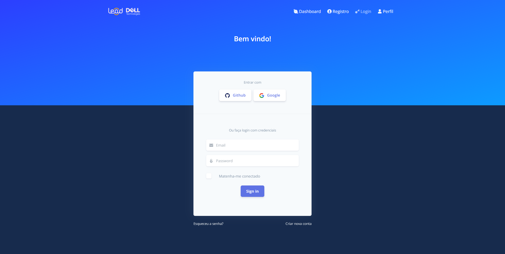

## Front-End Controle de ponto

#### Front-end destinado ao [Projeto controle de ponto](https://github.com/Jhonvtxn/ControleDePonto.git)

- Front desenvolvido utilizando o framework Angular.
- Usando o template <a href="https://www.creative-tim.com/product/argon-dashboard">Dashboard Argon</a>

## Tela de Login

