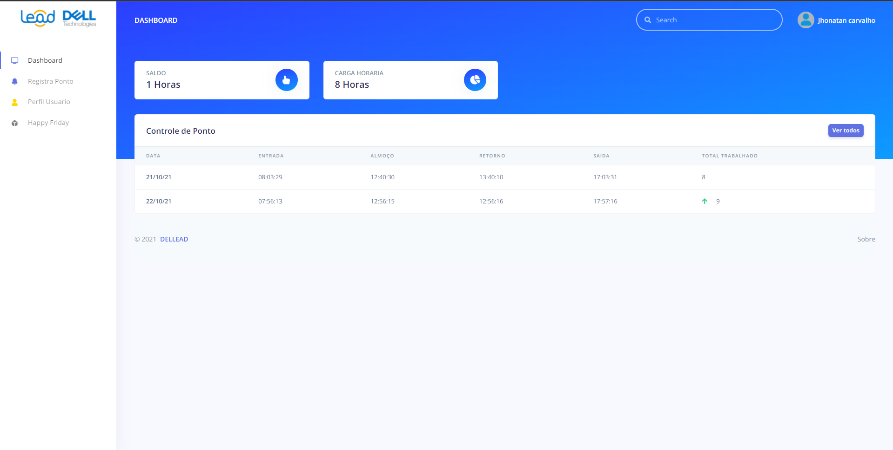
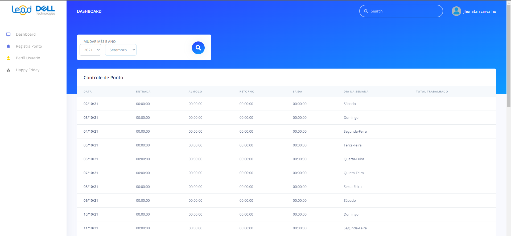
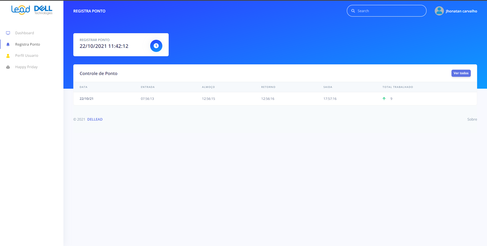
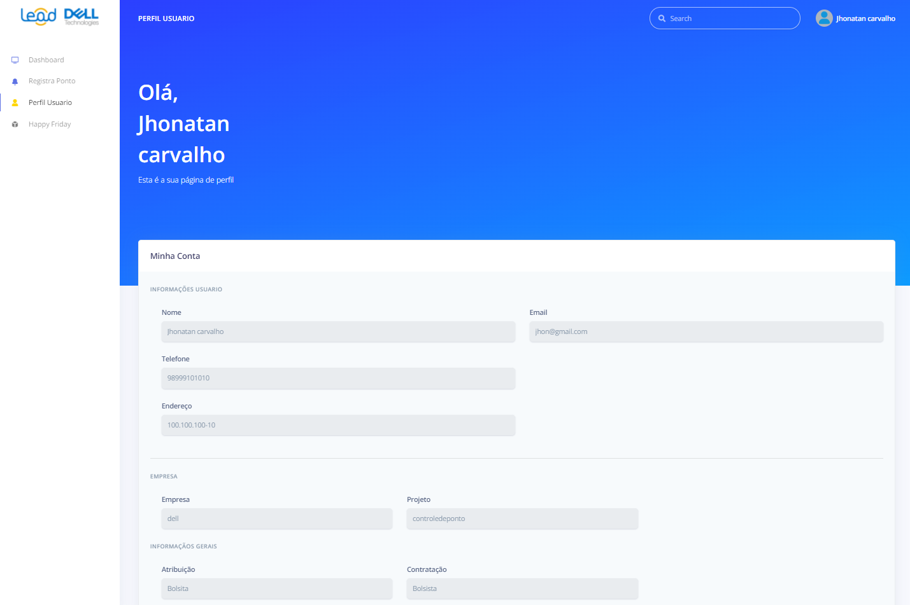
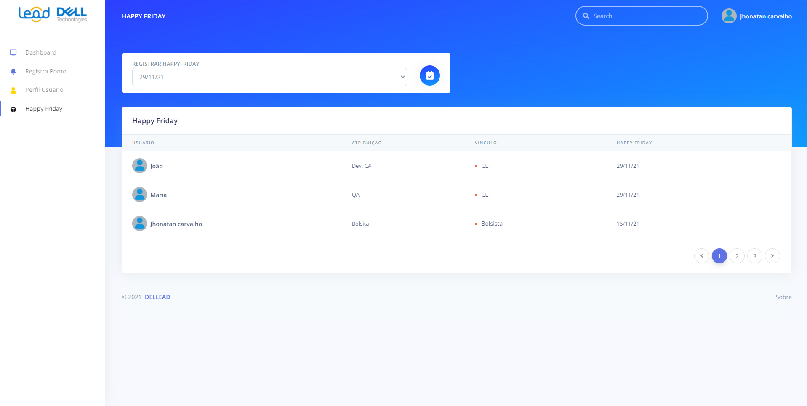
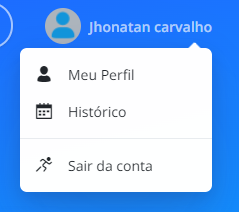

## Front-End Controle de ponto

#### Front-end destinado ao [Projeto controle de ponto](https://github.com/Jhonvtxn/ControleDePonto.git)

- Front desenvolvido utilizando o framework Angular.
- Usando o template <a href="https://www.creative-tim.com/product/argon-dashboard">Dashboard Argon</a>

## Tela de Login

## Dashboard
#### No Dashboard funcionario consegue visualizar os seus horários dos últimos 7 dias trabalhados, sua carga horária e seu saldo de horas.

##### Observação sobre o dashboard
- Basta clicar em "ver todos" para visualizar seus horarios completos, filtrando por Mês e Ano especifico.

## Registrar Ponto
#### Na tela de bater ponto o usuário ao clicar no icone, será capaz de registrar seu ponto com o horario atual sendo avisado com um Pop-up em caso de sucesso ou erro ao registrar ponto.

## Perfil do usuário
#### Nesta tela é exibida as informações do usuário

## HappyFriday (Registro de folga)
#### A tela de HappyFriday permite que o usuário cadastre sua folga com antecedência e sendo exibida para seus colegas de equipe.

## Observação
 - Você pode sair da conta a qualquer momento somente clicando no seu nome e em seguida em "Sair da conta", no quanto superior direto, em qualquer das telas informadas anteriormente.

## Contato
- Jhonatan De Sousa Carvalho - jhonatancarv0@gmail.com
- [Meu Linkedin](https://www.linkedin.com/in/jhonvtan/)

(<a href="#top">Voltar ao início</a>)

